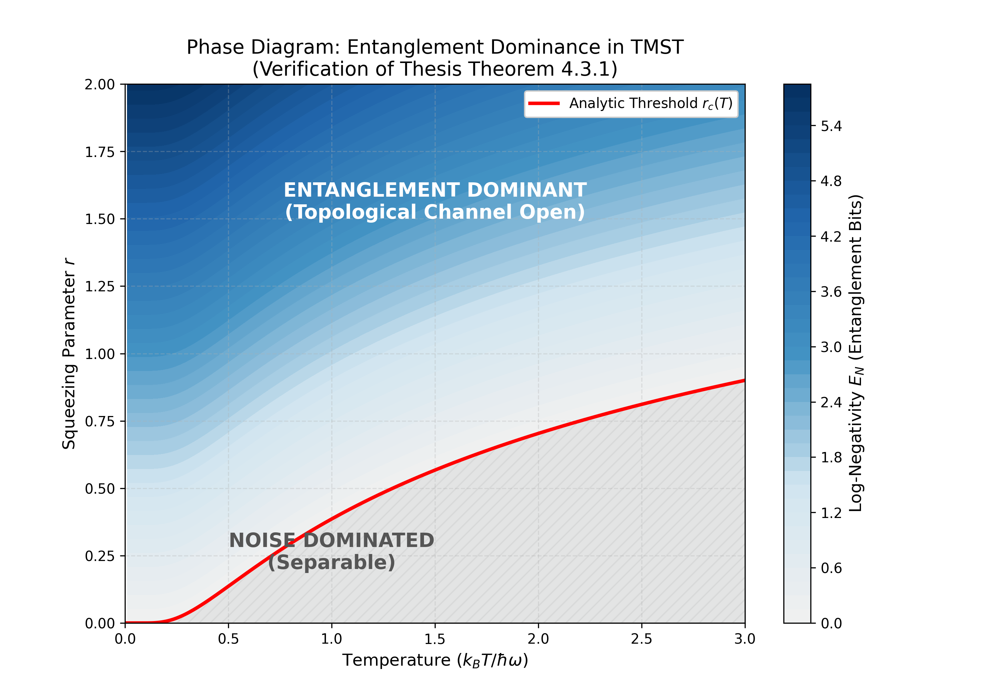

# Entanglement-Dominance-TMST (E-D TMST)

**Author:** Javier Manuel Martín Alonso  
**Field:** Independent Researcher (Asturias, Spain)  
**Applications:** ALICE (LHC), Belle II (SuperKEKB), AdS/CFT Duality

## 🌌 Overview

**Entanglement-Dominance-TMST** is a computational framework designed to identify and simulate dominant entanglement patterns within high-energy many-body systems. By bridging experimental data from heavy-ion collisions (ALICE) and precision lepton-hadron physics (Belle II), this algorithm explores the emergence of the "perfect fluid" and spacetime geometry through the lens of the **Holographic Principle**.

The core objective is to map quantum correlations from the boundary (conformal field theories) to the bulk (gravity in Anti-de Sitter space), following the research lines the **Ryu-Takayanagi conjecture**.

This repository contains the numerical verification code for the thesis:  
**"Entanglement Dominance in the Zero-Temperature Limit"**  
*Javier Manuel Martín Alonso (2026)*  
https://doi.org/10.5281/zenodo.18353640

---

## 🔬 Key Features

- **Holographic Mapping:** Tools to compute entanglement entropy in e⁺e⁻ and Pb-Pb systems to test AdS/CFT predictions 
- **Data Optimization:** Specifically tuned to handle massive datasets from ALICE (5.02 TeV) by identifying "Entanglement Dominance" zones, reducing computational overhead
- **Planck Scale Precision:** Analysis of the limits where singularities emerge and the breakdown of classical time-formalisms occurs 
- **Belle II Control:** Integration of precision measurements from Belle II to act as a "gold standard" for entanglement entropy benchmarks 

---

## 📐 The Physics

This software reproduces **Theorem 4.3.1** and **Figure 4.1** of the manuscript. It maps the phase transition between thermal separability and topological entanglement in symmetric **Two-Mode Squeezed Thermal (TMST)** states.

The code solves the exact boundary where the symplectic eigenvalue $\tilde{\nu}_-$ drops below $1/2$. The **"Entanglement Dominance"** regime is defined where the squeezing parameter \(r\) exceeds the thermal noise floor:

$$r > \frac{1}{2} \ln(2\bar{n}(T) + 1)$$
where $\bar{n}(T)$ is the thermal occupation number at temperature $T$


*Figure 4.1: Phase diagram showing the critical temperature threshold for entanglement dominance in symmetric TMST states.*
---

## 🚀 Installation & Usage

### Requirements
```bash
pip install -r requirements.txt

Run Simulation

py main.py

Output
The script generates a phase diagram (entanglement_phase_diagram.png) showing the critical temperature threshold for vacuum stability 

🧪 Theoretical Context
Nature doesn't just respect thresholds; it reveals itself through the "cracks" of singularities. This algorithm is built on the premise that:

Spacetime is emergent: Born from quantum entanglement 

Perfect Fluids (QGP): Can be modeled as holographic duals of black holes 

Singularities: Are not failures of the model, but windows into fundamental quantum information 

🤝 Collaboration & Feedback
This project is actively seeking feedback from the Theoretical Physics community, specifically from researchers working on:

Loop Quantum Gravity

Quantum Information Theory

Heavy Ion Phenomenology

AdS/CFT Correspondence

Belle II and ALICE experimental data analysis

If you are part of the Belle II collaboration or involved in holographic approaches to QCD, your insights are especially welcome 

📄 Citation
If you use this software in your research, please cite:

@misc{martin2026entanglement,
  author = {Martín Alonso, Javier Manuel},
  title = {Entanglement Dominance in the Zero-Temperature Limit},
  year = {2026},
  doi = {10.5281/zenodo.18353640},
  url = {https://doi.org/10.5281/zenodo.18353640}
}

📜 License
MIT License

"Looking at the light through the cracks of reality with the curiosity of a child."


